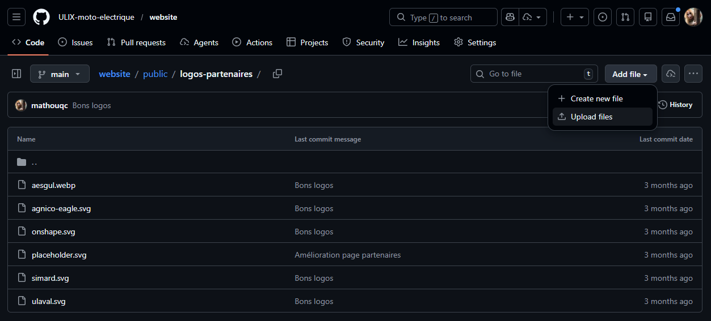
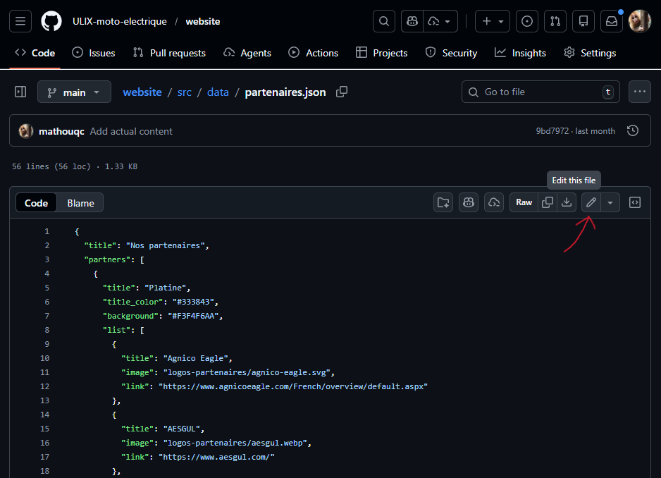
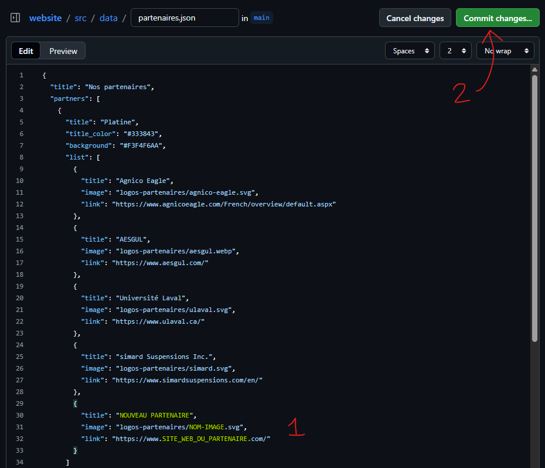

# ULIX website

Site web officiel d'ULIX

## Guide

### Comment ajouter un partenaire ?

1. Ajouter le logo dans le dossier `public/logos-partenaires`. \
S'assurer que le format est en svg si possible pour une meilleure qualité, sinon webp, sinon png/jpg.

2. Ajouter les informations du partenaire dans le fichier `src/data/partenaires.json`.

### Comment modifier les membres du comité administratif ?

1. Mettre à jour la photo dans le dossier `public/photos-comite`.
2. Mettre à jour les informations dans le fichier `src/data/comite.json`.
